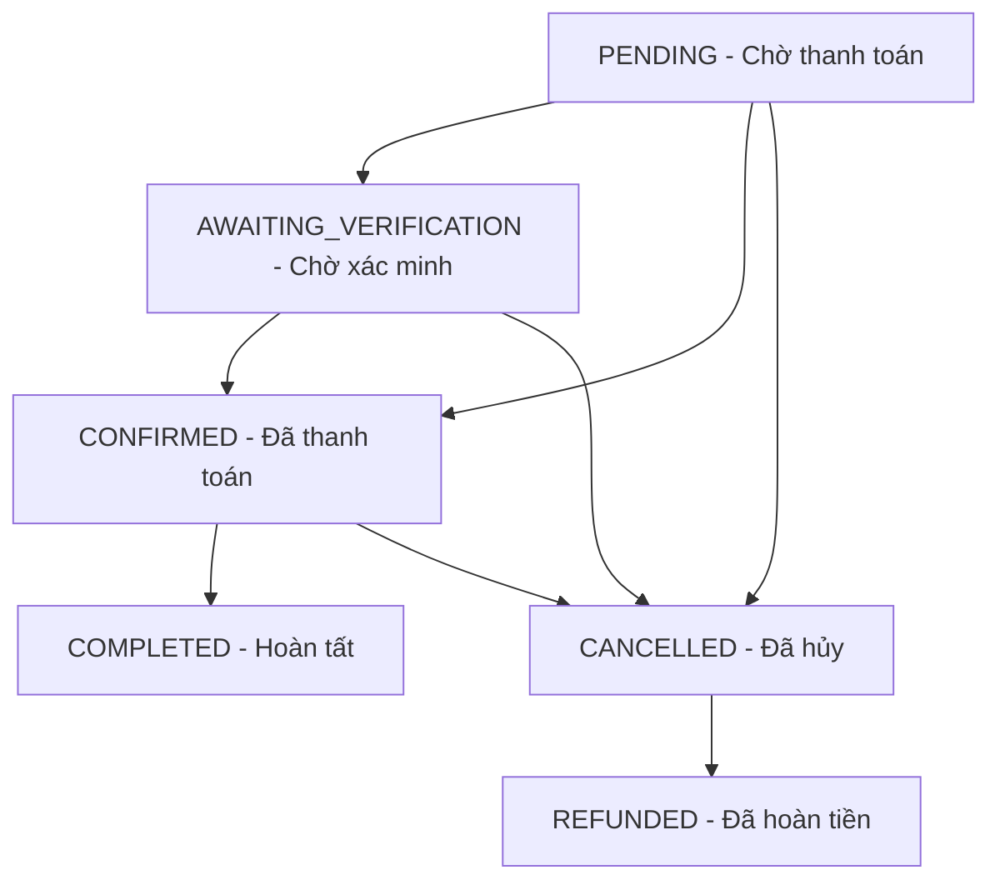

# 📄 Tài liệu API – Optics Management

**Phiên bản:** 5.0  
**Cơ sở URL:**

- Module Auth: `/api/auth`
- Module Users, Products, Lenses, Addresses, Feedbacks, Dashboard, Refund: `/api/`
- Module Orders: `/orders` (hoặc `/api/orders`, `/api/management/orders`)
- Module Payment: `/payment` (hoặc `/api/payment`)

**Định dạng dữ liệu:** JSON (một số API dùng `multipart/form-data` cho việc tải ảnh / tệp tin).  
**Xác thực:** JWT token qua header `Authorization: Bearer <token>`.

---

## 📌 Quy tắc & Định dạng chung

### Mã trạng thái HTTP:

- **200 OK:** Thành công.
- **201 Created:** Tạo mới thành công.
- **400 Bad Request:** Dữ liệu đầu vào sai / hết hàng / vi phạm điều kiện nghiệp vụ / lỗi validate.
- **401 Unauthorized:** Chưa đăng nhập hoặc token không hợp lệ / hết hạn.
- **403 Forbidden:** Đã đăng nhập nhưng không đủ quyền hoặc bị từ chối thao tác (self-action, locked account).
- **404 Not Found:** Không tìm thấy tài nguyên.
- **500 Internal Server Error:** Lỗi phát sinh phía Server.

### Định dạng response chuẩn:

Các API đa phần trả về wrapper chuẩn:

```json
{
  "code": 0,
  "message": "...",
  "result": { ... }
}
```

Một số endpoint (Product variants, Lenses) dùng biến thể `{ "success": true, "result": ... }` hoặc `{ "success": true, "data": ... }`, còn `GET /api/products/:id` trả về đối tượng Product trực tiếp.

### Các vai trò người dùng (Roles):

- **CUSTOMER:** Khách hàng mua sắm
- **MANAGER:** Quản lý cửa hàng (sản phẩm, tròng kính, đơn hàng, hoàn tiền, dashboard)
- **ADMIN:** Quản trị viên tối cao (quản lý người dùng, xóa đơn hàng, toàn quyền Manager)

---

## 1. Xác thực (Auth API) — Base: `/api/auth`

### 1.1 Đăng ký tài khoản

- **Endpoint:** `POST /api/auth/register`
- **Quyền:** Public
- **Body (JSON):**
  ```json
  {
    "username": "customer123",
    "email": "customer@example.com",
    "password": "strongPassword123",
    "first_name": "Nguyen",
    "last_name": "Van A",
    "phone": "0912345678",
    "dob": "1995-10-15",
    "avatar_url": "https://..."
  }
  ```
- **Response (201):**
  ```json
  {
    "message": "Đăng ký thành công. Vui lòng kiểm tra hộp thư email để kích hoạt tài khoản.",
    "user": {
      "_id": "...",
      "username": "customer123",
      "email": "customer@example.com",
      "role": "CUSTOMER",
      "is_email_verified": false
    }
  }
  ```

### 1.2 Đăng nhập

- **Endpoint:** `POST /api/auth/login`
- **Quyền:** Public
- **Body (JSON):**
  ```json
  {
    "username": "customer123",
    "password": "strongPassword123"
  }
  ```
- **Response (200):**
  ```json
  {
    "token": "eyJhbGciOiJIUzI1NiIs...",
    "user": {
      "id": "...",
      "username": "customer123",
      "email": "customer@example.com",
      "role": "CUSTOMER"
    }
  }
  ```

### 1.3 Đăng nhập bằng Google OAuth2

- **Endpoint:** `POST /api/auth/google`
- **Quyền:** Public
- **Body (JSON):**
  ```json
  { "idToken": "google_credential_token_here..." }
  ```
- **Response (200):** giống `/login`, kèm thông tin user và token.

### 1.4 Xác minh email qua token

- **Endpoint:** `GET /api/auth/verify-email?token=<active_token>`
- **Quyền:** Public
- **Hành vi:** Redirect
  - Thành công → `${CLIENT_URL}/login?verified=true`
  - Thất bại → `${CLIENT_URL}/login?error=verify_failed`

### 1.5 Gửi lại email xác minh

- **Endpoint:** `POST /api/auth/resend-verify-email`
- **Quyền:** Public
- **Body (JSON):**
  ```json
  { "email": "customer@example.com" }
  ```
- **Response (200):** `{ "message": "Đã gửi lại email xác minh" }`

---

## 2. Người dùng (User API) — Base: `/api/users`

### 2.1 Xem thông tin tài khoản hiện tại

- **Endpoint:** `GET /api/users/me`
- **Quyền:** Đã đăng nhập (bất kỳ role)
- **Response (200):**
  ```json
  {
    "code": 0,
    "result": {
      "_id": "...",
      "username": "customer123",
      "email": "customer@example.com",
      "role": "CUSTOMER",
      "first_name": "Nguyen",
      "last_name": "Van A",
      "phone": "0912345678",
      "dob": "1995-10-15T00:00:00.000Z"
    }
  }
  ```

### 2.2 Cập nhật thông tin cá nhân hiện tại

- **Endpoint:** `PUT /api/users/me`
- **Quyền:** Đã đăng nhập
- **Body (JSON):**
  ```json
  {
    "first_name": "Nguyen",
    "last_name": "Van B",
    "phone": "0987654321",
    "dob": "1996-12-20"
  }
  ```
- **Response (200):** `{ "code": 0, "message": "Cập nhật thông tin thành công", "result": { ... } }`

### 2.3 Thay đổi mật khẩu cá nhân

- **Endpoint:** `PUT /api/users/me/change-password`
- **Quyền:** Đã đăng nhập
- **Body (JSON):**
  ```json
  {
    "oldPassword": "oldPassword123",
    "newPassword": "newSecretPassword123"
  }
  ```
- **Response (200):** `{ "code": 0, "message": "Đổi mật khẩu thành công" }`

### 2.4 Tạo tài khoản mới (ADMIN)

- **Endpoint:** `POST /api/users`
- **Quyền:** ADMIN
- **Body (JSON):**
  ```json
  {
    "first_name": "Tran",
    "last_name": "Van C",
    "username": "manager_new",
    "email": "manager_new@example.com",
    "password": "password123",
    "role": "MANAGER"
  }
  ```
- **Ghi chú:** Bypass quy trình xác minh email (`is_email_verified = true`).
- **Response (201):** `{ "code": 0, "message": "Cấp phát tài khoản thành công", "result": { ... } }`

### 2.5 Danh sách người dùng (ADMIN)

- **Endpoint:** `GET /api/users`
- **Quyền:** ADMIN
- **Query:** `?page=1&limit=20&role=MANAGER&search=nguyen`
- **Response (200):**
  ```json
  {
    "code": 0,
    "result": [ { "_id": "...", "username": "...", "email": "...", "role": "MANAGER", "deleted_at": null } ],
    "pagination": { "page": 1, "limit": 20, "total": 1, "totalPages": 1 }
  }
  ```

### 2.6 Chi tiết người dùng (ADMIN)

- **Endpoint:** `GET /api/users/:id`
- **Quyền:** ADMIN
- **Response (200):** `{ "code": 0, "result": { ...userWithoutPassword } }`

### 2.7 Đổi vai trò người dùng (ADMIN)

- **Endpoint:** `PUT /api/users/:id/role`
- **Quyền:** ADMIN
- **Body (JSON):**
  ```json
  { "role": "MANAGER" }
  ```
- **Quy tắc:** Chặn Admin tự đổi vai trò của chính mình (`403 SELF_ACTION_FORBIDDEN`).

### 2.8 Khóa / Mở khóa tài khoản (ADMIN)

- **Endpoint:** `PUT /api/users/:id/status`
- **Quyền:** ADMIN
- **Body (JSON):**
  ```json
  { "status": "INACTIVE" }
  ```
- **Quy tắc:** Đặt `deleted_at = new Date()` khi `INACTIVE`, `deleted_at = null` khi `ACTIVE`. Chặn can thiệp vào tài khoản ADMIN khác (`403 FORBIDDEN`).

### 2.9 Đặt lại mật khẩu tài khoản (ADMIN)

- **Endpoint:** `PUT /api/users/:id/reset-password`
- **Quyền:** ADMIN
- **Body (JSON):**
  ```json
  { "newPassword": "newPassword123" }
  ```
- **Quy tắc:** Chặn reset mật khẩu của tài khoản ADMIN khác (`403 FORBIDDEN`).

### 2.10 Xóa tài khoản vĩnh viễn (ADMIN)

- **Endpoint:** `DELETE /api/users/:id`
- **Quyền:** ADMIN
- **Quy tắc:** Chặn xóa tài khoản ADMIN (`403 FORBIDDEN`).

---

## 3. Giỏ hàng (Cart)

⚠️ Hệ thống **không** có API backend cho giỏ hàng.
Toàn bộ dữ liệu giỏ hàng được quản lý 100% ở Client bằng Zustand + LocalStorage với key `vision-cart-storage`.

---

## 4. Sản phẩm & Biến thể (Products API) — Base: `/api/products`

### 4.1 Danh sách sản phẩm (có lọc & phân trang)

- **Endpoint:** `GET /api/products`
- **Quyền:** Public — kèm token MANAGER/ADMIN (optional) thì `status` mới có hiệu lực (`status=ALL` xem tất cả). Khách luôn bị khóa ở `ACTIVE` và bị ẩn `LENS` khỏi danh mục chung.
- **Query Params:** `?page=1&limit=10&search=gọng&category=FRAME&brand=Gucci&gender=UNISEX&shape=Round&frameMaterial=Titanium&frameType=Full-Rim&minPrice=100000&maxPrice=1000000&status=ACTIVE&sortBy=price-asc`
  - `sortBy`: `newest` (mặc định) | `price-asc` | `price-desc`
- **Response (200):**
  ```json
  {
    "code": 0,
    "result": {
      "items": [
        {
          "_id": "...",
          "name": "Kính Mắt Tròn Gucci Rimless",
          "brand": "Gucci",
          "category": "FRAME",
          "price": 2500000,
          "discountPrice": 2200000,
          "status": "ACTIVE",
          "imageUrl": [{ "imageUrl": "/uploads/image.jpg" }]
        }
      ],
      "page": 0,
      "size": 10,
      "totalElements": 1,
      "totalPages": 1
    }
  }
  ```

### 4.2 Chi tiết sản phẩm

- **Endpoint:** `GET /api/products/:id`
- **Quyền:** Public — sản phẩm `INACTIVE` trả 404 với khách; chỉ token MANAGER/ADMIN xem được.
- **Response (200):** Trả về **trực tiếp** đối tượng Product (không bọc qua `{ code, result }`).

### 4.3 Thêm sản phẩm mới

- **Endpoint:** `POST /api/products`
- **Quyền:** MANAGER hoặc ADMIN
- **Định dạng:** `multipart/form-data`
  - `product`: chuỗi JSON mô tả sản phẩm (`name`, `brand`, `price`, `category`, `frameType`, `gender`, `shape`, `frameMaterial`,...).
  - `files`: tệp ảnh sản phẩm (tối đa 10 file, ≤ 10MB, PNG/JPEG/WEBP).
- **Response (201):** `{ "code": 0, "result": { ...product } }`

### 4.4 Cập nhật sản phẩm

- **Endpoint:** `PUT /api/products/:id`
- **Quyền:** MANAGER hoặc ADMIN
- **Định dạng:** `multipart/form-data`

### 4.5 Xóa sản phẩm

- **Endpoint:** `DELETE /api/products/:id`
- **Quyền:** MANAGER hoặc ADMIN
- **Hành vi:** cascade xóa toàn bộ biến thể của sản phẩm và dọn file ảnh cục bộ `/uploads/...`.

### 4.6 Biến thể sản phẩm (Product Variants)

- **Danh sách biến thể:** `GET /api/products/:productId/variants`
  - Public
  - Response: `{ "success": true, "result": [ { colorName, sku, sizeLabel, lensWidthMm, bridgeWidthMm, templeLengthMm, price, discountPrice, quantity, orderItemType, status, imageUrl } ] }`
- **Thêm biến thể:** `POST /api/products/:productId/variants`
  - Quyền: MANAGER/ADMIN — `multipart/form-data` (`variant` JSON string + `files`)
- **Import biến thể từ Excel:** `POST /api/products/:productId/variants/import-excel`
  - Quyền: MANAGER/ADMIN — `multipart/form-data` (file Excel `.xlsx`/`.xls`)
- **Cập nhật biến thể:** `PUT /api/products/:productId/variants/:variantId`
  - Quyền: MANAGER/ADMIN — `multipart/form-data`
- **Xóa biến thể:** `DELETE /api/products/:productId/variants/:variantId`
  - Quyền: MANAGER/ADMIN

---

## 5. Tròng kính (Lens API) — Base: `/api/lenses`

### 5.1 Danh sách tròng kính

- **Endpoint:** `GET /api/lenses`
- **Quyền:** Public
- **Query:** `?search=chống+tía+uv&status=ACTIVE` (mặc định status=ACTIVE)
- **Response (200):**
  ```json
  {
    "success": true,
    "count": 2,
    "data": [
      {
        "_id": "...",
        "name": "Tròng Kính Essilor Crizal Sapphire HR 1.60",
        "material": "Polycarbonate 1.60",
        "price": 850000,
        "discountPrice": 750000,
        "description": "Chống chói 360 độ, hạn chế trầy xước",
        "status": "ACTIVE"
      }
    ]
  }
  ```

### 5.2 Chi tiết tròng kính

- **Endpoint:** `GET /api/lenses/:id`
- **Quyền:** Public
- **Response (200):** `{ "success": true, "data": { ...lens } }`

### 5.3 Thêm tròng kính mới (MANAGER/ADMIN)

- **Endpoint:** `POST /api/lenses`
- **Quyền:** MANAGER hoặc ADMIN
- **Body (JSON):**
  ```json
  {
    "name": "Tròng Kính Chemi U2 1.67",
    "material": "High Index 1.67",
    "price": 1200000,
    "discountPrice": 1050000,
    "description": "Mỏng nhẹ cho độ cận cao",
    "status": "ACTIVE"
  }
  ```
- **Response (201):** `{ "success": true, "message": "Tạo tròng kính thành công", "data": { ... } }`

### 5.4 Cập nhật tròng kính (MANAGER/ADMIN)

- **Endpoint:** `PUT /api/lenses/:id`
- **Quyền:** MANAGER hoặc ADMIN
- **Body (JSON):** Các trường cần cập nhật (`name`, `material`, `price`, `discountPrice`, `description`, `status`).

### 5.5 Xóa tròng kính (MANAGER/ADMIN)

- **Endpoint:** `DELETE /api/lenses/:id`
- **Quyền:** MANAGER hoặc ADMIN
- **Hành vi:** Đổi trạng thái sang `INACTIVE`.

---

## 6. Sổ địa chỉ (Address API) — Base: `/api/addresses`

Tất cả endpoint đều yêu cầu đăng nhập; chỉ chủ sở hữu mới thao tác được với địa chỉ của mình.

### 6.1 Danh sách địa chỉ của tôi

- **Endpoint:** `GET /api/addresses`
- **Response (200):**
  ```json
  {
    "code": 0,
    "result": [
      {
        "_id": "...",
        "user_id": "...",
        "label": "Nhà",
        "recipient_name": "Nguyễn Văn A",
        "phone_number": "0912345678",
        "delivery_address": "123 Đường Láng, Hà Nội",
        "is_default": true
      }
    ]
  }
  ```

### 6.2 Thêm địa chỉ

- **Endpoint:** `POST /api/addresses`
- **Body (JSON):**
  ```json
  {
    "label": "Nhà",
    "recipientName": "Nguyễn Văn A",
    "phoneNumber": "0912345678",
    "deliveryAddress": "123 Đường Láng, Hà Nội",
    "isDefault": true
  }
  ```
- **Validate:** `recipientName` ≤ 100 ký tự, `phoneNumber` định dạng chuẩn VN (`^(\+84|0)\d{8,10}$`), `deliveryAddress` từ 3-300 ký tự.

### 6.3 Cập nhật địa chỉ

- **Endpoint:** `PUT /api/addresses/:id`
- **Body (JSON):** các field tùy chọn (`label`, `recipientName`, `phoneNumber`, `deliveryAddress`, `isDefault`).

### 6.4 Đặt địa chỉ mặc định

- **Endpoint:** `PUT /api/addresses/:id/default`

### 6.5 Xóa địa chỉ

- **Endpoint:** `DELETE /api/addresses/:id`
- **Ghi chú:** Nếu xóa địa chỉ mặc định, hệ thống tự đặt địa chỉ mới cập nhật gần nhất làm mặc định thay thế.

---

## 7. Đánh giá sản phẩm (Feedback API) — Base: `/api/feedbacks`

### 7.1 Lấy danh sách đánh giá của sản phẩm

- **Endpoint:** `GET /api/feedbacks/product/:productId`
- **Quyền:** Public
- **Response (200):** Trả về mảng đánh giá kèm thông tin người đánh giá (`first_name`, `last_name`, `avatar_url`).

### 7.2 Lấy danh sách đánh giá của tôi

- **Endpoint:** `GET /api/feedbacks/me`
- **Quyền:** Authenticated
- **Response (200):** `{ "code": 0, "result": [ { ...feedback, feedbackId, orderId, productId, imageUrls } ] }`

### 7.3 Lấy đánh giá theo đơn hàng

- **Endpoint:** `GET /api/feedbacks/order/:orderId`
- **Quyền:** Authenticated

### 7.4 Chi tiết đánh giá

- **Endpoint:** `GET /api/feedbacks/:feedbackId`
- **Quyền:** Authenticated

### 7.5 Tạo mới hoặc Cập nhật đánh giá

- **Endpoint:** `POST /api/feedbacks`
- **Quyền:** Authenticated
- **Định dạng:** `multipart/form-data`
  - Fields: `order_id`, `product_id`, `rating` (1-5), `comment`, `images` (tối đa 5 file ảnh).
- **Ghi chú:** Nếu người dùng đã đánh giá sản phẩm này trong đơn hàng trước đó, hệ thống sẽ tự động cập nhật đánh giá cũ thay vì báo lỗi.

### 7.6 Cập nhật đánh giá

- **Endpoint:** `PUT /api/feedbacks/:feedbackId`
- **Quyền:** Authenticated
- **Định dạng:** `multipart/form-data` (`rating`, `comment`, `images`)

### 7.7 Xóa đánh giá

- **Endpoint:** `DELETE /api/feedbacks/:feedbackId`
- **Quyền:** Authenticated

---

## 8. Đơn hàng (Orders API) — Base: `/orders` (hoặc `/api/orders`, `/api/management/orders`)

### 8.1 Tạo đơn hàng từ giỏ (CUSTOMER)

- **Endpoint:** `POST /orders/create`
- **Quyền:** Đã đăng nhập
- **Định dạng:** `multipart/form-data`
  - Field `prescriptionImage` (File ảnh toa thuốc - Tùy chọn)
  - Field `orderInfo` (JSON string):
    ```json
    {
      "deliveryAddress": "123 Đường Láng, Hà Nội",
      "recipientName": "Nguyễn Văn A",
      "phoneNumber": "0912345678",
      "items": [
        {
          "productVariantId": "6704944...",
          "lensId": "6704999...",
          "quantity": 1,
          "prescription": {
            "od": { "sph": -2.25, "cyl": -0.5, "axis": 90, "add": 1.0 },
            "os": { "sph": -2.00, "cyl": 0, "axis": 0, "add": 1.0 },
            "pd": 63
          }
        }
      ],
      "bankInfo": {
        "bankName": "Vietcombank",
        "bankAccountNumber": "10023...",
        "accountHolderName": "NGUYEN VAN A"
      }
    }
    ```
- **Validation:**
  - `recipientName` (≤ 100 ký tự), `phoneNumber` (VN format), `deliveryAddress` (3-300 ký tự).
  - `prescription`: validate thông số quang học qua `validatePrescriptionFields` (SPH `[-20..20]`, CYL `[-6..6]`, AXIS `[1..180]`, ADD `[0.75..4]`, PD `[20..40]`). Trả về 400 `VALIDATION_ERROR` nếu phát hiện sai lệch.
- **Luồng hoạt động:**
  1. Kiểm tra tồn kho của từng `ProductVariant`.
  2. Xác thực giá server-side (đọc `discountPrice > 0` hoặc `price` từ DB cho gọng + tròng).
  3. Trừ tồn kho biến thể bằng `$inc` âm.
  4. Tạo `Order` với trạng thái mặc định `PENDING` và tạo các `OrderItem` tương ứng.

### 8.2 Lịch sử đơn hàng của tôi

- **Endpoint:** `GET /orders/me`
- **Quyền:** Đã đăng nhập
- **Query:** `?page=0&size=10&status=PENDING`

### 8.3 Khách hàng tự hủy đơn

- **Endpoint:** `PUT /orders/:id/cancel`
- **Quyền:** Chủ đơn (CUSTOMER) hoặc MANAGER/ADMIN
- **Điều kiện:** Đơn ở trạng thái `PENDING`, `AWAITING_VERIFICATION`, hoặc `CONFIRMED`.
- **Hành vi:** Cập nhật trạng thái sang `CANCELLED` và hoàn kho biến thể (`$inc` dương).

### 8.4 Từ chối yêu cầu hủy đơn (MANAGER/ADMIN)

- **Endpoint:** `PUT /orders/:id/reject-cancel` (hoặc `PUT /api/refund/reject-cancel/:orderId`)
- **Quyền:** MANAGER hoặc ADMIN
- **Hành vi:** Đưa đơn hàng trở lại trạng thái xử lý bình thường (`CONFIRMED`).

### 8.5 Chi tiết đơn hàng

- **Endpoint:** `GET /orders/:id`
- **Quyền:** Chủ đơn hoặc MANAGER/ADMIN
- **Response (200):** Trả về wrapper `{ code, result }` với đối tượng đơn kèm `items` đã populate.

### 8.6 Cập nhật thông số đơn thuốc trong đơn hàng (MANAGER/ADMIN)

- **Endpoint:** `PUT /orders/:id/items/:itemId/prescription`
- **Quyền:** MANAGER hoặc ADMIN
- **Điều kiện:** Đơn đang ở trạng thái `AWAITING_VERIFICATION`.
- **Body (JSON):** `{ "prescription": { "od": { ... }, "os": { ... }, "pd": 63 } }`

### 8.7 Toàn bộ đơn hàng trong hệ thống (MANAGER/ADMIN)

- **Endpoint:** `GET /orders`
- **Quyền:** MANAGER hoặc ADMIN
- **Query:** `?status=PENDING&page=0&size=20`

### 8.8 Cập nhật trạng thái đơn (MANAGER/ADMIN)

- **Endpoint:** `PUT /orders/:id/status`
- **Quyền:** MANAGER hoặc ADMIN
- **Body (JSON):** `{ "status": "CONFIRMED" }`
- **Enum hợp lệ:** `PENDING`, `AWAITING_VERIFICATION`, `CONFIRMED`, `COMPLETED`, `CANCELLED`, `REFUNDED`.

### 8.9 Xóa đơn khỏi CSDL (ADMIN)

- **Endpoint:** `DELETE /orders/:id`
- **Quyền:** Chỉ ADMIN

---

## 9. Thanh toán VNPay (Payment API) — Base: `/payment` (hoặc `/api/payment`)

### 9.1 Tính yêu cầu thanh toán trước khi tạo đơn

- **Endpoint:** `POST /payment/orders/requirement`
- **Quyền:** Đã đăng nhập
- **Body (JSON):**
  ```json
  {
    "items": [{ "productVariantId": "67049448ca...", "quantity": 1 }]
  }
  ```

### 9.2 Sinh liên kết thanh toán VNPay

- **Endpoint:** `POST /payment/checkout`
- **Quyền:** Đã đăng nhập
- **Body (JSON):**
  ```json
  { "orderId": "6704b4cbca..." }
  ```
- **Response (200):** `{ "code": 0, "result": "https://sandbox.vnpayment.vn/paymentv2/vpcpay.html?..." }`

### 9.3 Callback VNPay từ Client Redirect

- **Endpoint:** `GET /payment/vnpay-callback`
- **Quyền:** Public
- **Xử lý:**
  - Xác thực chữ ký `vnp_SecureHash` bằng HmacSHA512.
  - Nếu `vnp_ResponseCode = '00'` → cập nhật `Order.status = CONFIRMED`.
  - Chuyển hướng khách về trang thành công/thất bại phía client.

### 9.4 Callback IPN Server-to-Server từ VNPay

- **Endpoint:** `GET /payment/vnpay-ipn`
- **Quyền:** Public (Merchant Portal VNPay gọi tự động)
- **Xử lý:** Đối sánh checksum và trả về response chuẩn VNPay `{ "RspCode": "00", "Message": "Confirm Success" }`.

### 9.5 Mock thanh toán (chỉ dùng local/test)

- **Endpoint:** `POST /payment/mock-checkout`
- **Quyền:** Đã đăng nhập
- **Body (JSON):** `{ "orderId": "..." }`

---

## 10. Hoàn tiền (Refund API) — Base: `/api/refund`

Toàn bộ endpoint yêu cầu MANAGER hoặc ADMIN.

### 10.1 Vô hiệu hóa biến thể (bước 1)

- **Endpoint:** `PATCH /api/refund/variant/:variantId/in-activate`

### 10.2 Danh sách đơn bị ảnh hưởng (bước 2)

- **Endpoint:** `GET /api/refund/affected-orders/:variantId`

### 10.3 Tạo lô hoàn tiền (bước 3)

- **Endpoint:** `POST /api/refund/create-batch`
- **Body (JSON):** `{ "orderIds": ["...", "..."] }`

### 10.4 Danh sách yêu cầu hoàn tiền sẵn sàng (bước 4)

- **Endpoint:** `GET /api/refund/ready`

### 10.5 Xác nhận hoàn tiền (bước 5)

- **Endpoint:** `POST /api/refund/:refundId/refund-checkout`
- **Hành vi:** `Refund.status = COMPLETED`, `Order.status = REFUNDED`, `Payment.status = UNPAID`.

---

## 11. Dashboard (Dashboard API) — Base: `/api/dashboard`

### 11.1 Thống kê doanh thu

- **Endpoint:** `GET /api/dashboard/revenue`
- **Quyền:** MANAGER hoặc ADMIN
- **Response (200):**
  ```json
  {
    "code": 1000,
    "message": "Success",
    "result": {
      "revenue": 725000000,
      "revenueGrowth": -12.5,
      "activeOrders": 12,
      "ordersToday": 3,
      "returnPending": 0,
      "lowStockItems": 5
    }
  }
  ```

---

## 📌 Vòng đời trạng thái đơn hàng (Order Status Lifecycle)

Hệ thống quản lý 6 trạng thái với chuyển dịch logic:



**Tự động hóa:**

- Background Cleanup Job (`server.js`) chạy mỗi 5 phút quét đơn `PENDING` quá 15 phút → cập nhật `CANCELLED` và hoàn kho biến thể.
- Đơn `CANCELLED` đã thanh toán VNPay đủ điều kiện đưa vào luồng hoàn tiền (Section 10) → sau khi MANAGER chuyển khoản thủ công → `REFUNDED`.
