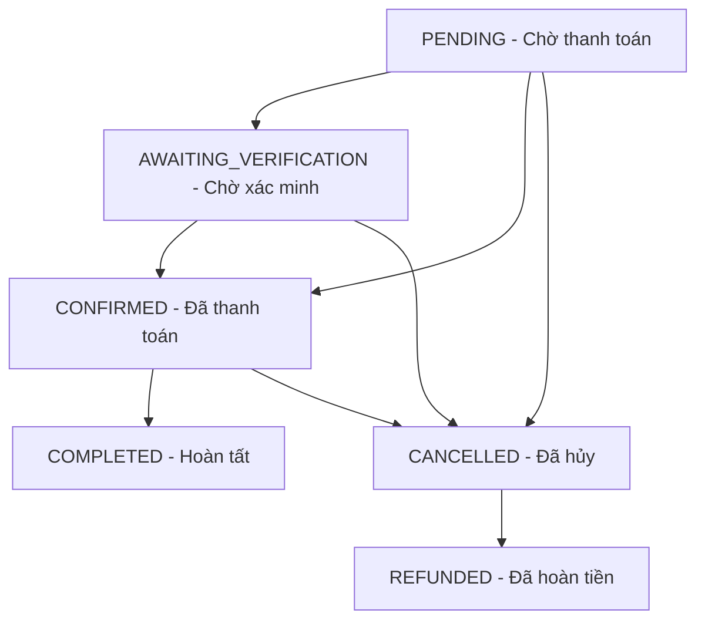

# 📄 Tài liệu API – Optics Management

**Phiên bản:** 4.0
**Cơ sở URL:**
- Module Auth: `http://localhost:5000/api/auth`
- Module Users, Products, Addresses, Dashboard, Refund: `http://localhost:5000/api`
- Module Orders: `http://localhost:5000/orders` (tương đương `http://localhost:5000/api/orders` và `http://localhost:5000/api/management/orders`)
- Module Payment: `http://localhost:5000/payment` (tương đương `http://localhost:5000/api/payment`)

**Định dạng dữ liệu:** JSON (một số API dùng `multipart/form-data` cho việc tải ảnh).
**Xác thực:** JWT token qua header `Authorization: Bearer <token>`.

---

## 📌 Quy tắc & Định dạng chung

### Mã trạng thái HTTP:
- **200 OK:** Thành công.
- **201 Created:** Tạo mới thành công.
- **400 Bad Request:** Dữ liệu đầu vào sai / hết hàng / vi phạm điều kiện nghiệp vụ.
- **401 Unauthorized:** Chưa đăng nhập hoặc token không hợp lệ.
- **403 Forbidden:** Đã đăng nhập nhưng không đủ quyền.
- **404 Not Found:** Không tìm thấy tài nguyên.
- **500 Internal Server Error:** Lỗi phát sinh phía Server.

### Định dạng response chuẩn:
Các API đa phần trả về wrapper:
```json
{
  "code": 0,
  "message": "...",
  "result": { ... }
}
```
Một số endpoint (Product variants) dùng biến thể `{ "success": true, "result": ... }`, còn `GET /api/products/:id` trả về đối tượng Product trực tiếp.

### Các vai trò người dùng (Roles):
- Vai trò đang được sử dụng: `CUSTOMER` (Khách hàng), `MANAGER` (Quản lý cửa hàng), `ADMIN` (Quản trị viên hệ thống).
- Enum User còn khai báo `SALE` và `SHIPPER` nhưng **chưa gắn route/nghiệp vụ** trong phiên bản hiện tại.

---

## 1. Xác thực (Auth API) — Base: `/api/auth`

### 1.1 Đăng ký tài khoản
- **Endpoint:** `POST /api/auth/register`
- **Quyền:** Public
- **Body (JSON):**
  ```json
  {
    "username": "customer123",
    "email": "customer@example.com",
    "password": "strongPassword123",
    "first_name": "Nguyen",
    "last_name": "Van A",
    "phone": "0912345678",        // Tùy chọn
    "dob": "1995-10-15",           // Tùy chọn
    "avatar_url": "https://..."    // Tùy chọn
  }
  ```
- **Response (201):**
  ```json
  {
    "message": "Đăng ký thành công. Vui lòng kiểm tra hộp thư email để kích hoạt tài khoản.",
    "user": {
      "_id": "...",
      "username": "customer123",
      "email": "customer@example.com",
      "role": "CUSTOMER",
      "is_email_verified": false
    }
  }
  ```

### 1.2 Đăng nhập
- **Endpoint:** `POST /api/auth/login`
- **Quyền:** Public
- **Body (JSON):**
  ```json
  {
    "username": "customer123",
    "password": "strongPassword123"
  }
  ```
- **Response (200):**
  ```json
  {
    "token": "eyJhbGciOiJIUzI1NiIs...",
    "user": {
      "id": "...",
      "username": "customer123",
      "email": "customer@example.com",
      "role": "CUSTOMER"
    }
  }
  ```

### 1.3 Đăng nhập bằng Google OAuth2
- **Endpoint:** `POST /api/auth/google`
- **Quyền:** Public
- **Body (JSON):**
  ```json
  { "idToken": "google_credential_token_here..." }
  ```
- **Response (200):** giống `/login`, kèm thông tin user và token.

### 1.4 Xác minh email qua token
- **Endpoint:** `GET /api/auth/verify-email?token=<active_token>`
- **Quyền:** Public
- **Hành vi:** Redirect
  - Thành công → `${CLIENT_URL}/login?verified=true`
  - Thất bại → `${CLIENT_URL}/login?error=verify_failed`

### 1.5 Gửi lại email xác minh
- **Endpoint:** `POST /api/auth/resend-verify-email`
- **Quyền:** Public
- **Body (JSON):**
  ```json
  { "email": "customer@example.com" }
  ```
- **Response (200):** `{ "message": "Đã gửi lại email xác minh" }`

---

## 2. Người dùng (User API) — Base: `/api/users`

### 2.1 Xem thông tin tài khoản hiện tại
- **Endpoint:** `GET /api/users/me`
- **Quyền:** Đã đăng nhập (bất kỳ role)
- **Response (200):**
  ```json
  {
    "code": 0,
    "result": {
      "_id": "...",
      "username": "customer123",
      "email": "customer@example.com",
      "role": "CUSTOMER",
      "first_name": "Nguyen",
      "last_name": "Van A",
      "phone": "0912345678"
    }
  }
  ```

### 2.2 Tạo tài khoản mới (ADMIN)
- **Endpoint:** `POST /api/users/`
- **Quyền:** ADMIN
- **Body (JSON):** giống payload đăng ký, cho phép truyền `role`.

### 2.3 Danh sách người dùng
- **Endpoint:** `GET /api/users/`
- **Quyền:** ADMIN
- **Query:** `?role=MANAGER&search=nguyen`
- **Response (200):** `{ "code": 0, "result": [ { ...user } ] }`

### 2.4 Chi tiết người dùng
- **Endpoint:** `GET /api/users/:id`
- **Quyền:** ADMIN

### 2.5 Đổi vai trò người dùng
- **Endpoint:** `PUT /api/users/:id/role`
- **Quyền:** ADMIN
- **Body (JSON):**
  ```json
  { "role": "MANAGER" }   // CUSTOMER | MANAGER | ADMIN
  ```

### 2.6 Khóa / Mở khóa tài khoản
- **Endpoint:** `PUT /api/users/:id/status`
- **Quyền:** ADMIN
- **Body (JSON):**
  ```json
  { "status": "INACTIVE" }  // hoặc "ACTIVE"
  ```
- **Chú giải:** Khóa tài khoản ghi mốc thời gian vào trường `deleted_at`.

### 2.7 Đặt lại mật khẩu
- **Endpoint:** `PUT /api/users/:id/reset-password`
- **Quyền:** ADMIN
- **Body (JSON):**
  ```json
  { "newPassword": "..." }
  ```

### 2.8 Xóa tài khoản vĩnh viễn
- **Endpoint:** `DELETE /api/users/:id`
- **Quyền:** ADMIN

---

## 3. Giỏ hàng (Cart)

⚠️ Hệ thống **không** có API backend cho giỏ hàng.
Toàn bộ dữ liệu giỏ hàng được quản lý 100% ở Client bằng Zustand + LocalStorage với key `vision-cart-storage`.

---

## 4. Sản phẩm & Biến thể (Products API) — Base: `/api/products`

### 4.1 Danh sách sản phẩm (có lọc & phân trang)
- **Endpoint:** `GET /api/products`
- **Quyền:** Public
- **Query Params:** `?page=1&limit=10&search=gọng&category=FRAME&brand=Gucci&gender=UNISEX&shape=Round&frameMaterial=Titanium&frameType=Full-Rim&minPrice=100000&maxPrice=1000000&status=ACTIVE`
- **Response (200):**
  ```json
  {
    "code": 0,
    "result": {
      "items": [
        {
          "_id": "...",
          "name": "Kính Mắt Tròn Gucci Rimless",
          "brand": "Gucci",
          "category": "FRAME",
          "gender": "UNISEX",
          "price": 2500000,
          "discountPrice": 2200000,
          "status": "ACTIVE",
          "imageUrl": [{ "imageUrl": "/uploads/image.jpg" }]
        }
      ],
      "page": 0,
      "size": 1,
      "totalElements": 1,
      "totalPages": 1
    }
  }
  ```

### 4.2 Chi tiết sản phẩm
- **Endpoint:** `GET /api/products/:id`
- **Quyền:** Public
- **Response (200):** Trả về **trực tiếp** đối tượng Product (không bọc qua `{ code, result }`).

### 4.3 Thêm sản phẩm mới
- **Endpoint:** `POST /api/products`
- **Quyền:** MANAGER hoặc ADMIN
- **Định dạng:** `multipart/form-data`
  - `product`: chuỗi JSON mô tả sản phẩm (`name`, `brand`, `price`, `category`, `frameType`, `gender`, `shape`, `frameMaterial`,...).
  - `files`: tệp ảnh sản phẩm.
- **Response (201):** `{ "code": 0, "result": { ...product } }`

### 4.4 Cập nhật sản phẩm
- **Endpoint:** `PUT /api/products/:id`
- **Quyền:** MANAGER hoặc ADMIN
- **Định dạng:** `multipart/form-data` (như 4.3)

### 4.5 Xóa sản phẩm
- **Endpoint:** `DELETE /api/products/:id`
- **Quyền:** MANAGER hoặc ADMIN
- **Response (200):** `{ "code": 0, "message": "Xóa sản phẩm thành công" }`

### 4.6 Biến thể sản phẩm (Product Variants)
- **Danh sách biến thể:** `GET /api/products/:productId/variants`
  - Public
  - Response: `{ "success": true, "result": [ { colorName, sku, sizeLabel, lensWidthMm, bridgeWidthMm, templeLengthMm, price, discountPrice, quantity, orderItemType, status, imageUrl } ] }`
- **Thêm biến thể:** `POST /api/products/:productId/variants`
  - Quyền: MANAGER/ADMIN
  - Định dạng: `multipart/form-data` (`variant` JSON string + `files` ảnh biến thể)
  - Body chứa: `sku`, `colorName`, `frameFinish`, `lensWidthMm`, `bridgeWidthMm`, `templeLengthMm`, `sizeLabel`, `price`, `discountPrice`, `quantity`, `orderItemType` (`IN_STOCK` | `PRE_ORDER`).
  - Response (201): `{ "success": true, "result": { ... } }`
- **Cập nhật biến thể:** `PUT /api/products/:productId/variants/:variantId`
  - Quyền: MANAGER/ADMIN — `multipart/form-data`
- **Xóa biến thể:** `DELETE /api/products/:productId/variants/:variantId`
  - Quyền: MANAGER/ADMIN

---

## 5. Sổ địa chỉ (Address API) — Base: `/api/addresses`

Tất cả endpoint đều yêu cầu đăng nhập; chỉ chủ sở hữu mới thao tác được với địa chỉ của mình.

### 5.1 Danh sách địa chỉ của tôi
- **Endpoint:** `GET /api/addresses`
- **Response (200):**
  ```json
  {
    "code": 0,
    "result": [
      {
        "_id": "...",
        "user_id": "...",
        "label": "Nhà",
        "recipient_name": "Nguyễn Văn A",
        "phone_number": "0912345678",
        "delivery_address": "123 Đường Láng, Hà Nội",
        "is_default": true
      }
    ]
  }
  ```

### 5.2 Thêm địa chỉ
- **Endpoint:** `POST /api/addresses`
- **Body (JSON):**
  ```json
  {
    "label": "Nhà",
    "recipientName": "Nguyễn Văn A",
    "phoneNumber": "0912345678",
    "deliveryAddress": "123 Đường Láng, Hà Nội",
    "isDefault": true
  }
  ```
- **Ghi chú:** Địa chỉ đầu tiên tự động là mặc định.

### 5.3 Cập nhật địa chỉ
- **Endpoint:** `PUT /api/addresses/:id`
- **Body (JSON):** các field tùy chọn (`label`, `recipientName`, `phoneNumber`, `deliveryAddress`, `isDefault`).

### 5.4 Đặt địa chỉ mặc định
- **Endpoint:** `PUT /api/addresses/:id/default`

### 5.5 Xóa địa chỉ
- **Endpoint:** `DELETE /api/addresses/:id`
- **Ghi chú:** Nếu xóa địa chỉ mặc định, hệ thống tự đặt địa chỉ mới cập nhật gần nhất làm mặc định thay thế.

---

## 6. Đơn hàng (Orders API) — Base: `/orders` (hoặc `/api/orders`, `/api/management/orders`)

### 6.1 Tạo đơn hàng từ giỏ (CUSTOMER)
- **Endpoint:** `POST /orders/create`
- **Quyền:** Đã đăng nhập
- **Định dạng:** `multipart/form-data`
  - Field `orderInfo` (JSON string):
    ```json
    {
      "deliveryAddress": "123 Đường Láng, Hà Nội",
      "recipientName": "Nguyễn Văn A",
      "phoneNumber": "0912345678",
      "items": [
        { "productVariantId": "6704944...", "quantity": 1 }
      ],
      "bankInfo": {                     // Tùy chọn — phục vụ luồng hoàn tiền
        "bankName": "Vietcombank",
        "bankAccountNumber": "10023...",
        "accountHolderName": "NGUYEN VAN A"
      }
    }
    ```
- **Luồng hoạt động:**
  1. Kiểm tra tồn kho của từng `ProductVariant`.
  2. Xác thực giá server-side (đọc `discountPrice > 0` hoặc `price` từ DB, không tin giá do client gửi).
  3. Trừ tồn kho biến thể bằng `$inc` âm.
  4. Tạo `Order` với trạng thái mặc định `PENDING` và tạo các `OrderItem` tương ứng.
- **Response (201):**
  ```json
  {
    "code": 0,
    "message": "Tạo đơn hàng thành công",
    "result": {
      "orderId": "6704b...",
      "order": { ... }
    }
  }
  ```

### 6.2 Lịch sử đơn hàng của tôi
- **Endpoint:** `GET /orders/me`
- **Quyền:** Đã đăng nhập
- **Query:** `?page=0&size=10&status=PENDING`
- **Response (200):**
  ```json
  {
    "code": 0,
    "result": {
      "items": [
        {
          "orderId": "6704b...",
          "orderName": "Đơn hàng #3F2A1E",
          "orderStatus": "PENDING",
          "deliveryAddress": "...",
          "totalAmount": 2500000,
          "finalTotalAfterRefund": 2500000,
          "remainingAmount": 2500000,
          "items": [ ... ],
          "createdAt": "2026-06-22..."
        }
      ],
      "totalItems": 1,
      "page": 0,
      "size": 10,
      "totalPages": 1
    }
  }
  ```

### 6.3 Khách hàng tự hủy đơn
- **Endpoint:** `PUT /orders/:id/cancel`
- **Quyền:** Chủ đơn (CUSTOMER) hoặc MANAGER/ADMIN
- **Điều kiện:** Đơn ở trạng thái `PENDING`, `AWAITING_VERIFICATION`, hoặc `CONFIRMED`.
- **Hành vi:** Cập nhật trạng thái sang `CANCELLED` và hoàn kho biến thể (`$inc` dương).

### 6.4 Chi tiết đơn hàng
- **Endpoint:** `GET /orders/:id`
- **Quyền:** Chủ đơn hoặc MANAGER/ADMIN
- **Response (200):** Trả về wrapper `{ code, result }` với đối tượng đơn kèm danh sách `items` đã populate `product_id`, `variant_id`.

### 6.5 Toàn bộ đơn hàng trong hệ thống
- **Endpoint:** `GET /orders` (tương đương `GET /api/management/orders`)
- **Quyền:** MANAGER hoặc ADMIN
- **Query:** `?status=PENDING`
- **Response (200):** `{ "code": 0, "result": [ ...order ] }`

### 6.6 Danh sách đơn CANCELLED đã thanh toán (chờ hoàn tiền)
- **Endpoint:** `GET /orders/cancelled/paid`
- **Quyền:** MANAGER hoặc ADMIN
- **Query:** `?page=0&size=10`
- **Response (200):**
  ```json
  {
    "code": 0,
    "result": {
      "items": [
        {
          "orderId": "...",
          "recipientName": "...",
          "phoneNumber": "...",
          "totalAmount": 2500000,
          "paidAmount": 2500000,
          "orderStatus": "CANCELLED",
          "deliveryAddress": "..."
        }
      ],
      "page": 0, "size": 10, "totalElements": 1, "totalPages": 1
    }
  }
  ```

### 6.7 Cập nhật trạng thái đơn (MANAGER/ADMIN)
- **Endpoint:** `PUT /orders/:id/status`
- **Quyền:** MANAGER hoặc ADMIN
- **Body (JSON):**
  ```json
  { "status": "CONFIRMED" }
  ```
- **Enum hợp lệ:** `PENDING`, `AWAITING_VERIFICATION`, `CONFIRMED`, `COMPLETED`, `CANCELLED`, `REFUNDED`.

### 6.8 Xóa đơn khỏi CSDL
- **Endpoint:** `DELETE /orders/:id`
- **Quyền:** Chỉ ADMIN
- **Ghi chú:** Xóa đồng thời tất cả `OrderItem` liên quan.

---

## 7. Thanh toán VNPay (Payment API) — Base: `/payment` (hoặc `/api/payment`)

### 7.1 Tính yêu cầu thanh toán trước khi tạo đơn
- **Endpoint:** `POST /payment/orders/requirement`
- **Quyền:** Đã đăng nhập
- **Body (JSON):**
  ```json
  {
    "items": [
      { "productVariantId": "67049448ca...", "quantity": 1 }
    ]
  }
  ```
- **Response (200):**
  ```json
  {
    "code": 0,
    "result": {
      "orderTotal": 2200000,
      "requiredAmount": 2200000,
      "requiredPaymentTotal": 2200000,
      "remainingPaymentTotal": 0,
      "itemRequirements": [
        {
          "productVariantId": "67049448ca...",
          "unitPrice": 2200000,
          "itemTotal": 2200000,
          "paymentPercentage": 1,
          "requiredPayment": 2200000
        }
      ]
    }
  }
  ```

### 7.2 Sinh liên kết thanh toán VNPay
- **Endpoint:** `POST /payment/checkout`
- **Quyền:** Đã đăng nhập
- **Body (JSON):**
  ```json
  { "orderId": "6704b4cbca..." }
  ```
- **Response (200):**
  ```json
  {
    "code": 0,
    "result": "https://sandbox.vnpayment.vn/paymentv2/vpcpay.html?vnp_Amount=2200000&..."
  }
  ```

### 7.3 Callback VNPay (IPN)
- **Endpoint:** `GET /payment/vnpay-callback`
- **Quyền:** Public (VNPay gọi tự động)
- **Xử lý:**
  - Xác thực chữ ký `vnp_SecureHash` bằng HmacSHA512.
  - Nếu `vnp_ResponseCode = '00'` → cập nhật `Order.status = CONFIRMED`.
  - Chuyển hướng khách về trang thành công/thất bại phía client.

### 7.4 Mock thanh toán (chỉ dùng local/test)
- **Endpoint:** `POST /payment/mock-checkout`
- **Quyền:** Đã đăng nhập
- **Body (JSON):**
  ```json
  { "orderId": "..." }
  ```
- **Ghi chú:** Giả lập callback thành công, cập nhật đơn thành `CONFIRMED` mà không đi qua cổng VNPay thật.

---

## 8. Hoàn tiền (Refund API) — Base: `/api/refund`

Toàn bộ endpoint yêu cầu MANAGER hoặc ADMIN.

### 8.1 Vô hiệu hóa biến thể (bước 1)
- **Endpoint:** `PATCH /api/refund/variant/:variantId/in-activate`
- **Hành vi:** Đặt `ProductVariant.status = INACTIVE`, ngăn khách đặt tiếp.

### 8.2 Danh sách đơn bị ảnh hưởng (bước 2)
- **Endpoint:** `GET /api/refund/affected-orders/:variantId`
- **Trả về:** Các đơn `PENDING`/`AWAITING_VERIFICATION`/`CONFIRMED` có chứa sản phẩm cha của biến thể, kèm số tiền đã thanh toán.

### 8.3 Tạo lô hoàn tiền (bước 3)
- **Endpoint:** `POST /api/refund/create-batch`
- **Body (JSON):**
  ```json
  { "orderIds": ["...", "..."] }
  ```
- **Hành vi:** Với mỗi đơn: cập nhật `Order.status = CANCELLED`, tạo bản ghi `Refund` với `status = PENDING`.

### 8.4 Danh sách yêu cầu hoàn tiền sẵn sàng (bước 4)
- **Endpoint:** `GET /api/refund/ready`
- **Trả về:** Danh sách `Refund` `PENDING` đã populate đơn + thông tin khách + `bank_info` phục vụ chuyển khoản thủ công.

### 8.5 Xác nhận hoàn tiền (bước 5)
- **Endpoint:** `POST /api/refund/:refundId/refund-checkout`
- **Hành vi:**
  - `Refund.status = COMPLETED`.
  - `Order.status = REFUNDED`.
  - `Payment.status` chuyển từ `PAID` sang `UNPAID` để phản ánh đã hoàn tiền.

---

## 9. Dashboard (Dashboard API) — Base: `/api/dashboard`

### 9.1 Thống kê doanh thu
- **Endpoint:** `GET /api/dashboard/revenue`
- **Quyền:** MANAGER hoặc ADMIN
- **Response (200):**
  ```json
  {
    "code": 1000,
    "message": "Success",
    "result": {
      "revenue": 725000000,
      "revenueGrowth": -12.5,
      "activeOrders": 12,
      "ordersToday": 3,
      "returnPending": 0,
      "lowStockItems": 5
    }
  }
  ```
- **Chú giải:**
  - `revenue`: tổng doanh thu từ các đơn `COMPLETED`.
  - `revenueGrowth`: tỷ lệ tăng trưởng doanh thu tháng hiện tại so với tháng trước (%).
  - `activeOrders`: đếm đơn ở các trạng thái `PENDING`, `AWAITING_VERIFICATION`, `CONFIRMED`.
  - `ordersToday`: số đơn phát sinh trong ngày (theo múi giờ GMT+7).
  - `lowStockItems`: số sản phẩm sắp hết hàng.

---

## 📌 Vòng đời trạng thái đơn hàng (Order Status Lifecycle)

Hệ thống quản lý 6 trạng thái với chuyển dịch logic:



**Tự động hóa:**
- Background Cleanup Job (`server.js`) chạy mỗi 5 phút quét đơn `PENDING` quá 15 phút → cập nhật `CANCELLED` và hoàn kho biến thể.
- Đơn `CANCELLED` đã thanh toán VNPay đủ điều kiện đưa vào luồng hoàn tiền (Section 8) → sau khi MANAGER chuyển khoản thủ công → `REFUNDED`.

---
*Tài liệu API được cập nhật dựa trên mã nguồn thực tế của dự án.*
