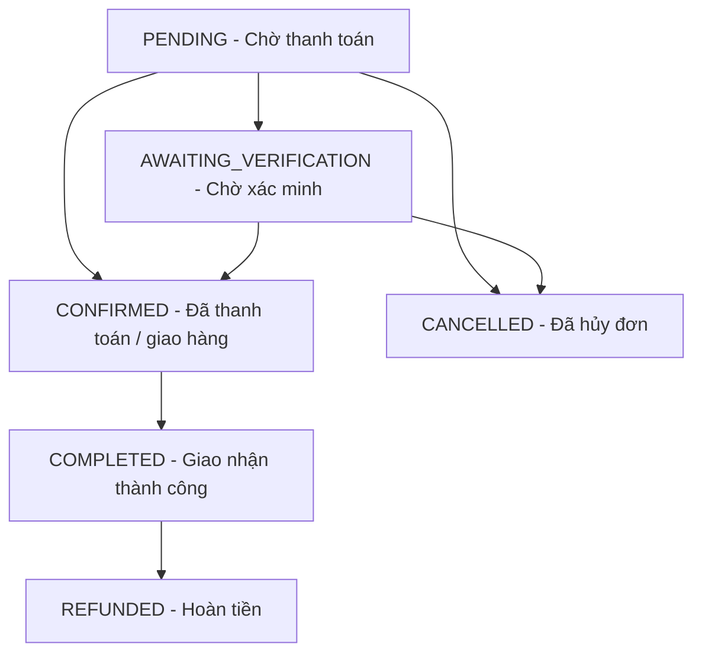

# 📄 Tài liệu API – Optics Management

**Phiên bản:** 3.0  
**Cơ sở URL:** 
- Module Auth, Users, Products, Dashboard: `http://localhost:5000/api`
- Module Orders: `http://localhost:5000/orders` (hoặc `http://localhost:5000/api/orders`)
- Module Payment: `http://localhost:5000/payment` (hoặc `http://localhost:5000/api/payment`)
**Định dạng dữ liệu:** JSON (Đầu vào có thể là JSON hoặc Multipart Form-Data tùy API)  
**Xác thực:** JWT token qua header `Authorization: Bearer <token>`

---

## 📌 Quy tắc & Định dạng chung

### Mã trạng thái HTTP (Response Code):
- **200 OK:** Yêu cầu được thực hiện thành công.
- **201 Created:** Tạo tài nguyên mới thành công.
- **400 Bad Request:** Dữ liệu đầu vào lỗi (lỗi Validation, hết hàng,...).
- **401 Unauthorized:** Yêu cầu Token xác thực hợp lệ.
- **403 Forbidden:** Không có quyền hạn truy cập (Quyền admin/manager).
- **404 Not Found:** Không tìm thấy tài nguyên (Sản phẩm, Người dùng, Đơn hàng).
- **500 Internal Server Error:** Lỗi phát sinh từ Server.

### Định dạng trả về tiêu chuẩn (Response Wrapper):
Các API đa phần trả về định dạng bọc đối tượng:
```json
{
  "code": 0,      // Hoặc success: true, tùy thuộc endpoint
  "message": "...",
  "result": { ... } // Chứa dữ liệu trả về chính
}
```

### Các vai trò người dùng (Roles):
`CUSTOMER` (Khách hàng), `SALE` (Nhân viên bán hàng), `MANAGER` (Quản lý), `SHIPPER` (Giao hàng), `ADMIN` (Quản trị viên).

---

## 1. Xác thực (Auth API) - Base: `/api/auth`

### 1.1 Đăng ký tài khoản
* **Endpoint:** `POST /api/auth/register`
* **Quyền:** Public
* **Dữ liệu gửi lên (JSON):**
  ```json
  {
    "username": "customer123",
    "email": "customer@example.com",
    "password": "strongPassword123",
    "first_name": "Nguyen",
    "last_name": "Van A",
    "phone": "0912345678",        // Tùy chọn
    "dob": "1995-10-15",          // Tùy chọn (định dạng ngày)
    "avatar_url": "https://..."   // Tùy chọn (định dạng URL)
  }
  ```
* **Mã trả về thành công (201):**
  ```json
  {
    "message": "Đăng ký thành công. Vui lòng kiểm tra hộp thư email để kích hoạt tài khoản.",
    "user": {
      "_id": "670402b8cae28c...",
      "username": "customer123",
      "email": "customer@example.com",
      "role": "CUSTOMER",
      "is_email_verified": false,
      "created_at": "2026-06-22..."
    }
  }
  ```

### 1.2 Đăng nhập hệ thống
* **Endpoint:** `POST /api/auth/login`
* **Quyền:** Public
* **Dữ liệu gửi lên (JSON):**
  ```json
  {
    "username": "customer123",
    "password": "strongPassword123"
  }
  ```
* **Mã trả về thành công (200):**
  ```json
  {
    "token": "eyJhbGciOiJIUzI1NiIs...",
    "user": {
      "id": "670402b8cae...",
      "username": "customer123",
      "email": "customer@example.com",
      "role": "CUSTOMER"
    }
  }
  ```

### 1.3 Đăng nhập bằng Google (Google OAuth2)
* **Endpoint:** `POST /api/auth/google`
* **Quyền:** Public
* **Dữ liệu gửi lên (JSON):**
  ```json
  {
    "idToken": "google_credential_token_here..."
  }
  ```
* **Mã trả về thành công (200):**
  ```json
  {
    "token": "eyJhbGciOiJIUzI1NiIs...",
    "user": {
      "id": "...",
      "username": "google_user_name",
      "email": "google_email@gmail.com",
      "role": "CUSTOMER"
    }
  }
  ```

### 1.4 Xác minh Email qua Kích hoạt Token
* **Endpoint:** `GET /api/auth/verify-email`
* **Quyền:** Public
* **Query Params:** `?token=<active_token>`
* **Hành vi trả về (Chuyển hướng):**
  - Thành công: Redirect sang `${CLIENT_URL}/login?verified=true`
  - Thất bại: Redirect sang `${CLIENT_URL}/login?error=verify_failed`

---

## 2. Thông tin Người dùng (User API) - Base: `/api/users`

### 2.1 Xem thông tin tài khoản hiện tại
* **Endpoint:** `GET /api/users/me`
* **Quyền:** Đã đăng nhập (CUSTOMER, SALE, MANAGER, SHIPPER, ADMIN)
* **Mã trả về thành công (200):**
  ```json
  {
    "code": 0,
    "result": {
      "_id": "670402b8cae...",
      "username": "customer123",
      "email": "customer@example.com",
      "role": "CUSTOMER",
      "first_name": "Nguyen",
      "last_name": "Van A",
      "phone": "0912345678",
      "dob": "1995-10-15T00:00:00.000Z"
    }
  }
  ```

### 2.2 Lấy danh sách toàn bộ người dùng
* **Endpoint:** `GET /api/users/`
* **Quyền:** Admin
* **Query Params:** `?role=SALE&search=john`
* **Mã trả về thành công (200):**
  ```json
  {
    "code": 0,
    "result": [
      {
        "_id": "67049448ca...",
        "username": "sale1",
        "email": "sale@shop.com",
        "role": "SALE",
        "first_name": "Nguyên",
        "last_name": "Văn B"
      }
    ]
  }
  ```

### 2.3 Xem chi tiết người dùng bất kỳ
* **Endpoint:** `GET /api/users/:id`
* **Quyền:** Admin
* **Mã trả về thành công (200):** Trả về thông tin chi tiết của người dùng có ID tương ứng (Không bao gồm mật khẩu).

### 2.4 Thay đổi vai trò (Role) của người dùng
* **Endpoint:** `PUT /api/users/:id/role`
* **Quyền:** Admin
* **Dữ liệu gửi lên (JSON hoặc Query):**
  ```json
  {
    "role": "MANAGER"  // Hỗ trợ: CUSTOMER, SALE, MANAGER, SHIPPER, ADMIN
  }
  ```
* **Mã trả về thành công (200):**
  ```json
  {
    "code": 0,
    "message": "Cập nhật vai trò người dùng thành công",
    "result": { ... }
  }
  ```

### 2.5 Khóa hoặc Mở khóa tài khoản người dùng
* **Endpoint:** `PUT /api/users/:id/status`
* **Quyền:** Admin
* **Dữ liệu gửi lên (JSON):**
  ```json
  {
    "status": "INACTIVE"  // Hoặc "ACTIVE" để mở khóa
  }
  ```
* **Chú giải:** Việc khóa tài khoản sẽ thiết lập mốc thời gian tại thuộc tính `deleted_at`.
* **Mã trả về thành công (200):**
  ```json
  {
    "code": 0,
    "message": "Khóa tài khoản thành công",
    "result": { ... }
  }
  ```

### 2.6 Xóa tài khoản người dùng vĩnh viễn
* **Endpoint:** `DELETE /api/users/:id`
* **Quyền:** Admin
* **Mã trả về thành công (200):**
  ```json
  {
    "code": 0,
    "message": "Tài khoản người dùng đã được xóa vĩnh viễn khỏi hệ thống"
  }
  ```

---

## 3. Quản lý Giỏ hàng (Cart)
⚠️ **LƯU Ý QUAN TRỌNG:** Hệ thống **không sử dụng bất kỳ API backend nào** liên quan đến giỏ hàng. 
- Toàn bộ dữ liệu giỏ hàng được quản lý 100% tại Client (Frontend) bằng Zustand + LocalStorage thông qua key lưu trữ `vision-cart-storage`.

---

## 4. Sản phẩm & Biến thể (Products API) - Base: `/api/products`

### 4.1 Lấy danh sách sản phẩm (có bộ lọc và phân trang)
* **Endpoint:** `GET /api/products`
* **Quyền:** Public
* **Query Params:** `?page=1&limit=10&search=gọng&category=FRAME&brand=Gucci&gender=UNISEX&shape=Round&frameMaterial=Titanium&frameType=Full-Rim&minPrice=100000&maxPrice=1000000&status=ACTIVE`
* **Mã trả về thành công (200):**
  ```json
  {
    "code": 0,
    "result": {
      "items": [
        {
          "_id": "67049448ca33a2ca39ba39ff",
          "name": "Kính Mắt Tròn Gucci Rimless",
          "brand": "Gucci",
          "category": "FRAME",
          "gender": "UNISEX",
          "price": 2500000,
          "discountPrice": 2200000,
          "stock_quantity": 25,
          "status": "ACTIVE",
          "imageUrl": [{ "imageUrl": "/uploads/image.jpg" }]
        }
      ],
      "page": 0,  // Lưu ý: 0-indexed trong response
      "size": 1,
      "totalElements": 1,
      "totalPages": 1
    }
  }
  ```

### 4.2 Lấy thông tin chi tiết một sản phẩm
* **Endpoint:** `GET /api/products/:id`
* **Quyền:** Public
* **Mã trả về thành công (200):** Trả về trực tiếp đối tượng Product lưu trữ trong CSDL (Không bọc qua `{ code, result }`).

### 4.3 Thêm sản phẩm mới kèm tải lên nhiều ảnh
* **Endpoint:** `POST /api/products`
* **Quyền:** Manager hoặc Admin
* **Định dạng ghi nhận:** `multipart/form-data`
  - Field `product`: Chuỗi JSON string chứa thông tin mô tả sản phẩm (Ví dụ: `{"name":"Gọng mới","price":1000,"brand":"Rayban",...}`)
  - Field `files`: Dữ liệu nhị phân của các tệp hình ảnh sản phẩm.
* **Mã trả về thành công (210):**
  ```json
  {
    "code": 0,
    "result": { ...product đối tượng... }
  }
  ```

### 4.4 Cập nhật thông tin sản phẩm
* **Endpoint:** `PUT /api/products/:id`
* **Quyền:** Manager hoặc Admin
* **Định dạng ghi nhận:** `multipart/form-data` (Cấu trúc tương tự như API thêm sản phẩm).
* **Mã trả về thành công (200):** `{ "code": 0, "result": { ... } }`

### 4.5 Xóa bỏ sản phẩm khỏi cơ sở dữ liệu
* **Endpoint:** `DELETE /api/products/:id`
* **Quyền:** Manager hoặc Admin
* **Mã trả về thành công (200):**
  ```json
  {
    "code": 0,
    "message": "Xóa sản phẩm thành công"
  }
  ```

### 4.6 Biến thể Sản phẩm (Product Variants sub-routes)
- **Danh sách biến thể:** `GET /api/products/:productId/variants`
  - Trả về (200): `{ "success": true, "result": [ { colorName, sizeLabel, price, quantity... } ] }`
- **Thêm biến thể mới:** `POST /api/products/:productId/variants`
  - Quyền: Manager/Admin | Body (JSON): màu sắc, số đo gọng (templeLengthMm, lensWidthMm,...), giá, số lượng.
  - Trả về (201): `{ "success": true, "result": { ... } }`
- **Cập nhật biến thể:** `PUT /api/products/:productId/variants/:variantId`
  - Quyền: Manager/Admin | Trả về (200): `{ "success": true, "result": { ... } }`
- **Xóa biến thể:** `DELETE /api/products/:productId/variants/:variantId`
  - Quyền: Manager/Admin | Trả về (200): `{ "success": true, "message": "Mã biến thể đã xóa thành công" }`

---

## 5. Xử lý Đơn hàng (Orders API) - Base: `/orders` hoặc `/api/orders`

### 5.1 Tạo đơn hàng từ giỏ (CUSTOMER)
* **Endpoint:** `POST /orders/create`
* **Quyền:** Đăng nhập bất kỳ (Customer)
* **Định dạng ghi nhận:** `multipart/form-data`
  - Field `orderInfo`: Chuỗi JSON đại diện thông tin vận chuyển và giỏ hàng:
    ```json
    {
      "deliveryAddress": "123 Đường Láng, Hà Nội",
      "recipientName": "Nguyễn Văn A",
      "phoneNumber": "0912345678",
      "items": [
        {
          "productVariantId": "6704944...",
          "quantity": 1,
          "lensId": null,
          "prescription": null
        }
      ],
      "bankInfo": { // Tùy chọn hoàn trả
        "bankName": "Vietcombank",
        "bankAccountNumber": "10023...",
        "accountHolderName": "NGUYEN VAN A"
      }
    }
    ```
  - Field `prescriptionImage`: Tệp hình ảnh toa thuốc đính kèm (Tùy chọn).
* **Luồng hoạt động:** 
  1. Sản phẩm sẽ bị **khấu trừ tồn kho** lập tức lúc tạo.
  2. Tạo bản ghi đơn hàng với trạng thái mặc định ban đầu là `PENDING`.
* **Mã trả về thành công (201):**
  ```json
  {
    "code": 0,
    "message": "Tạo đơn hàng thành công",
    "result": {
      "orderId": "6704b...",
      "order": { ... }
    }
  }
  ```

### 5.2 Lấy lịch sử đơn hàng của tôi (CUSTOMER)
* **Endpoint:** `GET /orders/me`
* **Quyền:** Người đặt hóa đơn đăng nhập
* **Query Params:** `?page=0&size=10`
* **Mã trả về thành công (200):**
  ```json
  {
    "code": 0,
    "result": {
      "items": [
        {
          "orderId": "6704b...",
          "orderName": "Đơn hàng #3F2A1E",
          "orderStatus": "PENDING",
          "deliveryAddress": "...",
          "totalAmount": 2500000,
          "finalTotalAfterRefund": 2500000,
          "remainingAmount": 2500000, // Nếu ở trạng thái PENDING thì cần thanh toán nốt toàn bộ
          "items": [ ... ],
          "createdAt": "2026-06-22..."
        }
      ],
      "totalItems": 1,
      "page": 0,
      "size": 10,
      "totalPages": 1
    }
  }
  ```

### 5.3 Khách hàng tự hủy đơn hàng
* **Endpoint:** `PUT /orders/:id/cancel`
* **Quyền:** Chủ đơn hàng
* **Chú giải:** Chỉ cho phép khách hàng hủy đơn hàng khi đơn hàng đang ở trạng thái `PENDING`. Hệ thống sẽ **hoàn trả số lượng tồn kho sản phẩm** tương ứng ngay lập tức.
* **Mã trả về thành công (200):**
  ```json
  {
    "code": 0,
    "message": "Hủy đơn hàng thành công",
    "result": { ...order... }
  }
  ```

### 5.4 Xem chi tiết thông tin đơn hàng
* **Endpoint:** `GET /orders/:id`
* **Quyền:** Chủ đơn hàng hoặc Manager/Admin
* **Mã trả về thành công (200):** Trả về dữ liệu chi tiết cấu trúc hóa đơn cùng danh sách sản phẩm con bọc qua `{ code: 0, result: { ... } }`.

### 5.5 Xem toàn bộ đơn hàng trong hệ thống
* **Endpoint:** `GET /orders` (Hoặc `/api/management/orders`)
* **Quyền:** Manager hoặc Admin
* **Query Params:** `?status=PENDING`
* **Mã trả về thành công (200):** `{ "code": 0, "result": [ ... ] }`

### 5.6 Cập nhật trạng thái đơn hàng (MANAGER/ADMIN)
* **Endpoint:** `PUT /orders/:id/status`
* **Quyền:** Manager hoặc Admin
* **Dữ liệu gửi lên (JSON):**
  ```json
  {
    "status": "CONFIRMED" // Enum: PENDING, AWAITING_VERIFICATION, CONFIRMED, COMPLETED, CANCELLED, REFUNDED
  }
  ```
* **Mã trả về thành công (200):** `{ "code": 0, "message": "Cập nhật trạng thái đơn hàng thành công", "result": order }`

### 5.7 Xóa đơn hàng khỏi CSDL (Dọn dẹp hệ thống)
* **Endpoint:** `DELETE /orders/:id`
* **Quyền:** Admin duy nhất
* **Mã trả về thành công (200):**
  ```json
  {
    "code": 0,
    "message": "Đơn hàng và các sản phẩm liên quan đã được xóa thành công"
  }
  ```

---

## 6. Luồng Thanh toán cổng VNPay (Payment API) - Base: `/payment` hoặc `/api/payment`

### 6.1 Khởi tạo Yêu cầu thanh toán trước đơn hàng
* **Endpoint:** `POST /payment/orders/requirement`
* **Quyền:** Customer (Đã đăng nhập)
* **Dữ liệu gửi lên (JSON):**
  ```json
  {
    "items": [
      { "productVariantId": "67049448ca...", "quantity": 1 }
    ]
  }
  ```
* **Mã trả về thành công (200):**
  ```json
  {
    "code": 0,
    "result": {
      "orderTotal": 2200000,
      "requiredAmount": 2200000,
      "requiredPaymentTotal": 2200000,
      "remainingPaymentTotal": 0,
      "itemRequirements": [
        {
          "productVariantId": "67049448ca...",
          "unitPrice": 2200000,
          "lensPrice": 0,
          "itemTotal": 2200000,
          "paymentPercentage": 1,
          "requiredPayment": 2200000
        }
      ]
    }
  }
  ```

### 6.2 Khởi tạo liên kết ví/cổng toán VNPay
* **Endpoint:** `POST /payment/checkout`
* **Quyền:** Customer (Đã đăng nhập)
* **Dữ liệu gửi lên (JSON):**
  ```json
  {
    "orderId": "6704b4cbca..."
  }
  ```
* **Mã trả về thành công (200):**
  ```json
  {
    "code": 0,
    "result": "https://sandbox.vnpayment.vn/paymentv2/vpcpay.html?vnp_Amount=2200000&..."
  }
  ```

### 6.3 Callback công cộng xử lý kết quả VNPay
* **Endpoint:** `GET /payment/vnpay-callback`
* **Quyền:** Public (Gọi tự động từ VNPay IPN)
* **Xử lý bên dưới:**
  - Nếu kết quả VNPay gửi về thành công (ResponseCode `'00'`): Cập nhật trạng thái đơn thành `CONFIRMED`.
  - Chuyển hướng trình duyệt khách hàng về trang thành công hoặc thất bại tương ứng ở client.

---

## 7. Thống kê Hoạt động (Dashboard API) - Base: `/api/dashboard`

### 7.1 Lấy các số liệu thống kê doanh số
* **Endpoint:** `GET /api/dashboard/revenue`
* **Quyền:** Manager hoặc Admin
* **Mã trả về thành công (200):**
  ```json
  {
    "code": 1000,
    "message": "Success",
    "result": {
      "revenue": 725000000,       // Tổng doanh thu từ các đơn COMPLETED
      "revenueGrowth": -12.5,     // Tỷ lệ tăng trưởng so với tháng trước (%)
      "activeOrders": 12,         // Tổng đơn hàng đang PENDING, AWAITING_VERIFICATION, CONFIRMED
      "ordersToday": 3,           // Tổng số đơn phát sinh ngày hôm nay
      "returnPending": 0,
      "lowStockItems": 5          // Các sản phẩm sắp hết hàng (tồn dưới 10)
    }
  }
  ```

---

## 📌 Bộ Trạng thái Đơn hàng Thực tế (Order Status Lifecycle)

Mã nguồn dự án thực tế quản lý vòng đời đơn hàng qua **6 trạng thái** có thứ tự chuyển dịch logic như sau:



---
*Tài liệu đặc tả API được cập nhật dựa trên mã nguồn thực tế của dự án. Cập nhật ngày 22 tháng 06 năm 2026.*
